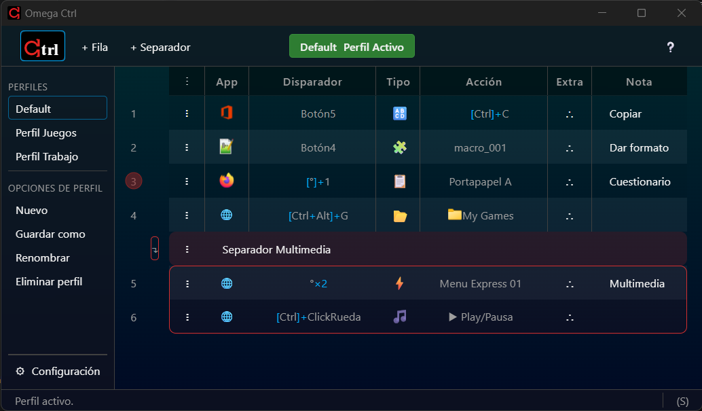
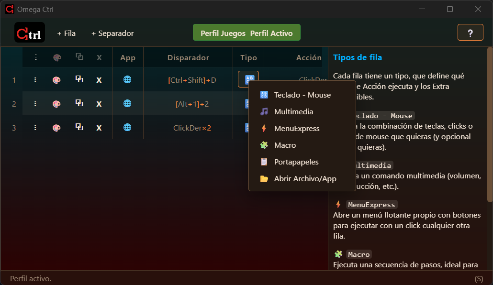
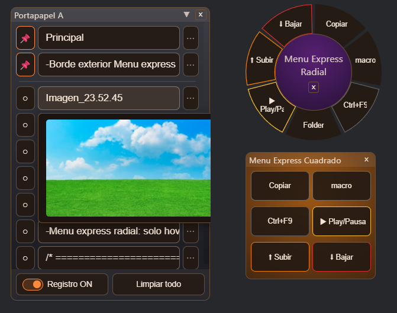
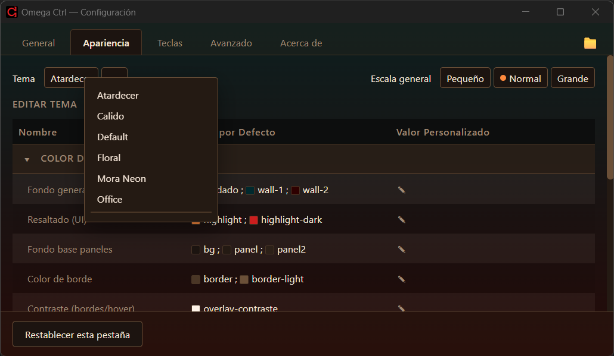
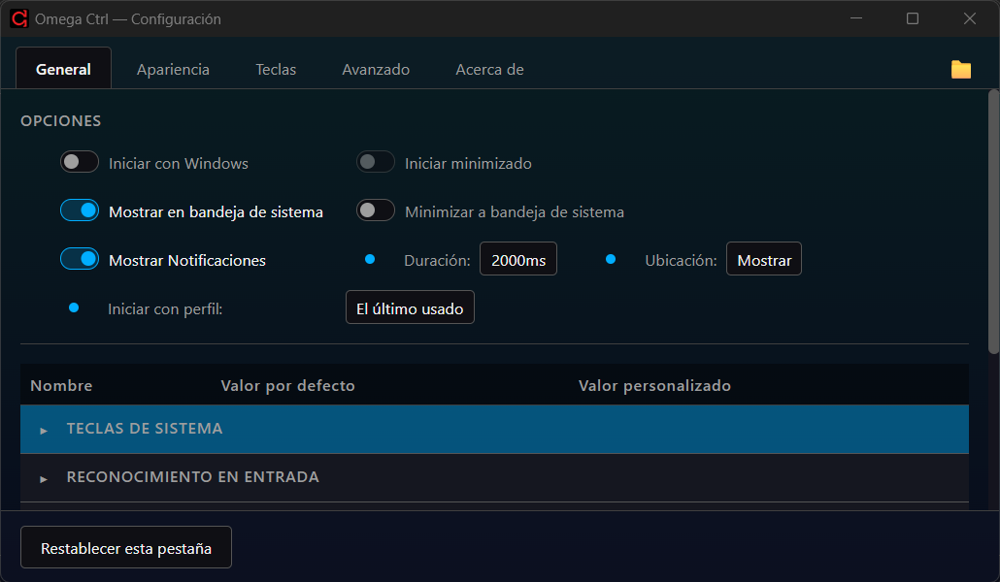
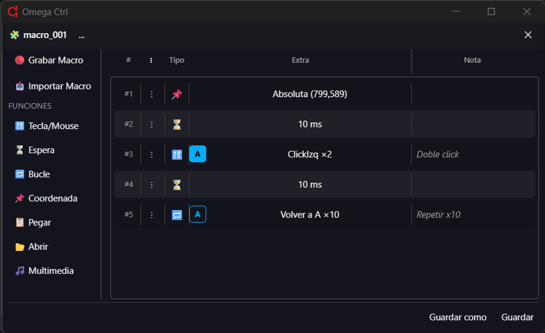
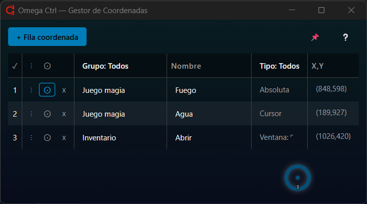

<meta name="google-site-verification" content="onbETz8-O4PzqViADf7w-6hH9ik9mSrSl67ULQHSfPE" />
# Omega Ctrl

Omega Ctrl es una moderna, eficiente y completa aplicación de escritorio para Windows (Tauri + Rust) que permite mediante pocos clicks y en menos de un minuto:

- Remapear teclado y mouse
- Crear Macros
- Crear tus propios Menús flotantes
- Tener múltiples Portapapeles

Todo organizado en **perfiles**, con **filas** que puedes activar/desactivar y personalizar por aplicación. Todo eso con un mínimo consumo de RAM (entre 5MB y 8MB aprox).



## Características

- **Una fila puede disparar:**
  - 🔠**Remapeo de teclado y mouse** (reasigna cualquier tecla o botón a otra tecla o combinación, con condición Simple / Mantenido / Turbo).
  - 🧩**Macro** (grabación y reproducción de secuencias de teclado/mouse).
  - 📂**Abrir archivo o aplicación** (con modo de ventana, instancias, o argumento personalizado).
  - 🎵**Multimedia** (control de reproducción, volumen, etc.), con alcance global o solo dentro de la app activa.
  - ⚡**Menú Express**: un menú flotente radial o en cuadrícula con botones propios, cada uno ejecutando su propia acción.
  - 📋**Portapapeles ampliado**: pool de elementos copiados (texto/imagen), fijables y con límite configurable.

- **Perfiles**: cada perfil es un conjunto independiente de remapeos. Se pueden crear, clonar, renombrar, eliminar y activar en cualquier momento desde el panel lateral o la bandeja del sistema.
- **Restricción por aplicación**: cada fila puede limitarse a una app específica (por ejecutable) o aplicar de forma global.
- **Dos motores de captura de entrada**:
  - **Interception** (requiere instalar el driver [Interception](http://www.oblita.com/interception)): más bajo nivel.
  - **Simple** (hooks nativos de WinAPI): no requiere instalar nada aparte, pensado para uso portable.

## Capturas de pantalla

- **Selecciona opciones en popups y obtén ayuda en la barra lateral**: Al poner brevemente el mouse sobre un objeto, se mostrará en ella una descripción del elemento y sus opciones configurables.

  

- **Portapapeles con previsualizador de imágenes y crea Menú Express con atajos a cualquier fila creada**:

  

- **Apariencia personalizable**: colores, opacidades y tamaños configurables por variable, con soporte de temas guardables/editables.

  

- **Multiples opciones de configuración**: puedes minimizar a bandeja de sistema, mostrar/ocultar ventana, cambiar de perfil desde el menú contextual del ícono.

  

- **Crea y edita Macros fácilmente**:

  

- **Gestor de Coordenadas**: Guarda y previsualiza conjuntos de coordenadas en relación a la pantalla, la ventana o el mouse. Úsalas luego en macros o para automatizar clicks.

  

## Requisitos

- Windows 10/11.
- [Node.js](https://nodejs.org/) (LTS reciente).
- [Rust](https://www.rust-lang.org/tools/install) + toolchain de compilación de Tauri (ver [prerrequisitos de Tauri](https://tauri.app/start/prerequisites/)).
- Opcional: driver [Interception](http://www.oblita.com/interception) si querés usar el motor Interception en vez del modo Simple.

## Desarrollo

Clonar el repositorio e instalar dependencias:

```bash
npm install
```

Levantar en modo desarrollo (hot-reload de frontend + backend Rust):

```bash
npm run tauri dev
```

Generar el build de producción (empaqueta el frontend estático, no depende de un servidor de desarrollo):

```bash
npm run tauri build
```

> El ejecutable generado por `tauri dev` (en `src-tauri/target/debug/`) apunta al servidor de desarrollo de Vite y **no funciona de forma standalone** (por ejemplo, al iniciarlo junto con Windows) — para eso usá el build de `tauri build`.

## Estructura del proyecto

- `src/` — frontend (TypeScript, sin framework), organizado por ventana (`ventanas/`), componentes reutilizables (`componentes/`) y lógica de UI/estado (`core/`, `ui/`).
- `src-tauri/src/` — backend Rust: captura de entrada (`entrada.rs`, `back_interception.rs`, `back_windows.rs`), perfiles (`perfil.rs`, `perfil_json.rs`), compilación de remapeos a caché (`compilador.rs`, `cache.rs`), y una ventana/feature por archivo `back_*.rs` (menú express, portapapeles, bandeja, notificaciones, etc.).
- Cada ventana tiene su propio `.html` en la raíz (`index.html`, `configuracion.html`, `menu_express.html`, `portapapeles.html`, `coordenadas.html`, `captura.html`, `indicador_macro.html`, `notificacion.html`).

## ⚠️ Limitaciones conocidas

1. ⚠️ Esto ocurre al usar el Modo Simple (API Windows) sin ejecutar como administrador: por limitación de Windows (no es un bug), tener el Administrador de Tareas en primer plano hace que los clicks dejen de responder en cualquier otra ventana. Esto se soluciona haciendo Alt+Tab. Para evitarlo se recomienda ejecutar Omega Ctrl como administrador.

2. ⚠️ Esto ocurre al ejecutar como administrador: por limitación de Windows (no es un bug), mientras Omega Ctrl está en primer plano no aparece la barra de captura de pantalla Windows al presionar Impr Pant, ya que Windows no permite mostrar ese overlay sobre una ventana elevada. En modo normal (sin administrador) esto no ocurre.

## Licencia


